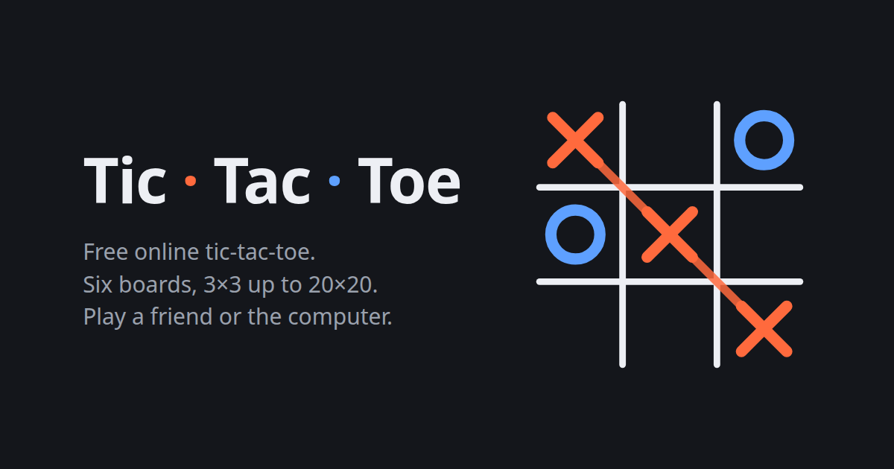

# Tic · Tac · Toe

A polished tic-tac-toe web game — no frameworks, no build step, no backend. Just open it and play.

*Also known as: the XO game, XOX, OXO, OOO game, Xs and Os, noughts and crosses — and Gomoku
(five in a row) on the big boards.*

**▶ Play it live:** https://heamvisal.github.io/Tic-Tac-Toe-Web_Game/



## Features

- **Three ways to play**
  - **Two players** — pass and play on one device
  - **Vs computer** — three difficulties: *Easy* (random), *Tricky* (wins and blocks), *Perfect* (unbeatable minimax on 3×3, strong heuristic on bigger boards)
  - **Online friend** — click, get a game key, share the invite link, and play in real time,
    with built-in chat: free messages, an emoji bar and quick-chat taunts ("You're too slow 🐢", "Noob 🤡", …).
    Chat sits beside the board on desktop, below it on phones, and incoming messages pop up as toasts
- **Player names** — pick a name on entry (or keep the suggested PlayerN default); names appear on the
  scoreboard, in chat and on your opponent's screen
- **No accidental clicks** — new round / reset scores ask for confirmation; in online games both players
  must accept, and leaving an online game (switching mode or closing the tab) warns you first
- **Six board sizes**

  | Board | Marks in a row to win |
  |-------|----------------------|
  | 3×3   | 3 (classic)          |
  | 5×5   | 4                    |
  | 7×7   | 5                    |
  | 10×10 | 5                    |
  | 15×15 | 5                    |
  | 20×20 | 5                    |

- Animated marks, win strike-through, light/dark theme, keyboard navigation, screen-reader labels
- Scores and settings saved in your browser between visits

## Online play — how it works

Online mode is fully peer-to-peer over **WebRTC** (via [PeerJS](https://peerjs.com/), bundled in `assets/`).
The host's browser registers a random 6-character game key with PeerJS's free public broker; the friend's
browser uses that key (from the invite link `?join=KEY`) to open a direct connection. After the handshake,
all moves travel browser-to-browser — no game server, which is what lets the whole thing run on GitHub Pages.

The host plays **X** and starts; the guest plays **O**. Only the host can change the board size, and
rounds, scores and board changes stay in sync on both screens.

> Note: on very restrictive networks (some corporate/school NATs) WebRTC may fail to connect,
> since the free setup has no TURN relay.

## Project structure

```
index.html          Markup, SEO/social meta, structured data
style.css           All styles (custom font embedded as data URI)
script.js           Game engine, AI and online play
assets/
  favicon.svg       Site icon
  og-image.png      Social share preview
  peerjs.min.js     PeerJS library (loaded only for online mode)
robots.txt          Crawler rules
sitemap.xml         Sitemap for search engines
```

## Run locally

No build needed — it's plain HTML/CSS/JS:

```bash
git clone https://github.com/HeamVisal/Tic-Tac-Toe-Web_Game.git
cd Tic-Tac-Toe-Web_Game
python3 -m http.server 8000   # or any static server
```

Then open http://localhost:8000. (Opening `index.html` straight from disk works too;
online mode just needs the page to be served over HTTP/HTTPS in some browsers.)

## Hosting

Made for **GitHub Pages**: enable it in *Settings → Pages → Deploy from a branch* (`master`, root).
All asset paths are relative, so it also works on any other static host.
